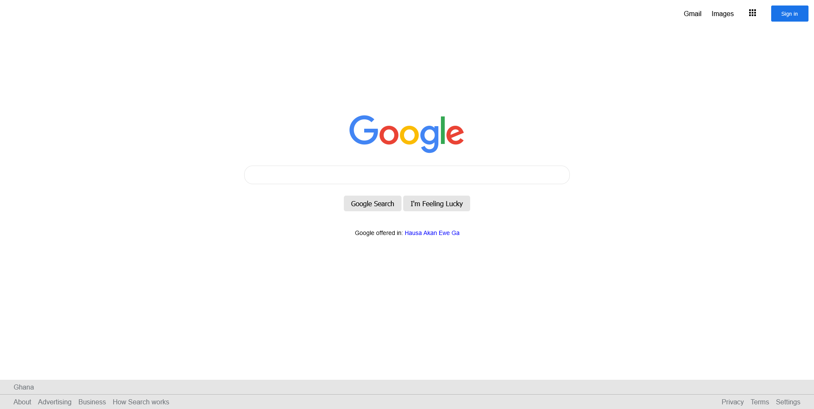

# Google Home Page Task

This is a solution to the Google Home Page task under Zuri Training's Front End Track

## Table of contents

- [Overview](#overview)
  - [The challenge](#the-challenge)
  - [Screenshot](#screenshot)
- [My process](#my-process)
  - [Built with](#built-with)
  - [What I learned](#what-i-learned)
  - [Continued development](#continued-development)
  - [Useful resources](#useful-resources)
- [Author](#author)
- [Acknowledgments](#acknowledgments)

## Overview

### The challenge

- Recreate the Google Home page.

### Screenshot

## My process

### Built with

- HTML5 markup
- CSS custom properties

### What I learned

- Position can be replaced using flex.

### Continued development

I will be focusing on completing all Zuri Training challenges

### Useful resources

- [Video](https://www.youtube.com/watch?v=969_jGiJOXo) - A guide on solving the challenge Part 1
- [Video](https://www.youtube.com/watch?v=z8XFA2IB3Yk) - A guide on solving the challenge Part 2

## Author

- Twitter - [@justinjoe6](https://www.twitter.com/justinjoe6)

## Acknowledgments

Thanks to Zuri Training for the free training and challenge.
